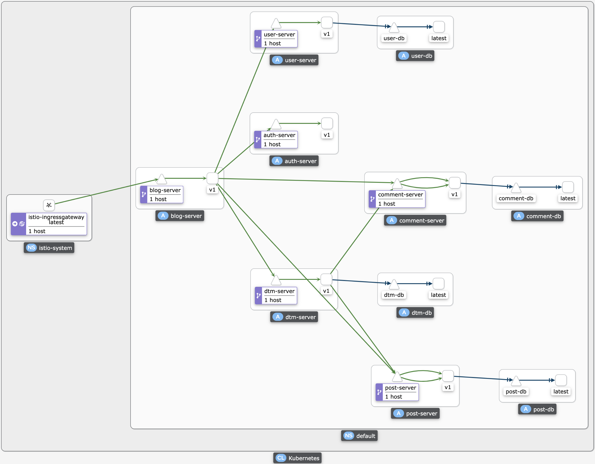

# blog-microservices

[](https://github.com/jxlwqq/blog-microservices/actions/workflows/test.yaml)
[](https://github.com/jxlwqq/blog-microservices/actions/workflows/lint.yml)
[](https://goreportcard.com/report/github.com/jxlwqq/blog-microservices)
[](https://codecov.io/gh/jxlwqq/blog-microservices)

A blog microservices written in Golang, which can be deployed in an Istio-enabled kubernetes cluster. If you’re using this demo, please ★Star this
repository to show your interest!

[English](README.md) | [中文](README-zh.md)

### Architecture


### Kiali Console



### Project Layout

This demo refers to the following project layout:

* [Standard Go Project Layout](https://github.com/golang-standards/project-layout)
* [Go RESTful API Starter Kit (Boilerplate)](https://github.com/qiangxue/go-rest-api)
* [Kratos Project Template](https://github.com/go-kratos/kratos-layout)

### Full list what has been used

* [gRPC](https://github.com/grpc/grpc-go) Go implementation of gRPC
* [GORM](https://github.com/go-gorm/gorm) The fantastic ORM library for Go
* [DTM](https://github.com/dtm-labs/dtm) Go implementation of Distributed Transaction Management Framework
* [Jaeger](https://www.jaegertracing.io/) open source, end-to-end distributed tracing
* [Prometheus](https://prometheus.io/) Monitoring system
* [Grafana](https://grafana.com/) Operational dashboards
* [Kiali](https://kiali.io/) The Console for Istio Service Mesh
* [Kubernetes](https://kubernetes.io/) Production-Grade Container Orchestration
* [Istio](https://istio.io/) The leading service mesh

### Makefile

| Command                | Description                                                                          |
|------------------------|--------------------------------------------------------------------------------------|
| `make init`            | go install protoc-gen-*, wire, migrate and mockgen                                   |
| `make protoc`          | generate *pb.go                                                                      |
| `make wire`            | generate wire_gen.go                                                                 |
| `make mock`            | generate mock file                                                                   |
| `make test`            | go test                                                                              |
| `make migrate-up`      | migrate up databases                                                                 |
| `make migrate-down`    | migrate down databases                                                               |
| `make migrate-refresh` | migrate down and up databases                                                        |
| `make blog-server`     | start blog server in local                                                           |
| `make user-server`     | start user server in local                                                           |
| `make post-server`     | start post server in local                                                           |
| `make comment-server`  | start comment server in local                                                        |
| `make auth-server`     | start auth server in local                                                           |
| `make dtm-server`      | start dtm server in local，please see [the dtm docs](https://github.com/dtm-labs/dtm) |
| `make docker-build`    | build docker images                                                                  |
| `make kube-deploy`     | deploy blog, user, post, comment, auth and dtm server in kubernetes cluster          |
| `make kube-delete`     | delete all servers in kubernetes cluster                                             |
| `make kube-redeploy`   | redeploy all servers in kubernetes cluster (⚠ not including database servers️)       |

### Development Environment in Local

This is a list of development environment in local for macOS:

* docker-desktop >= 4.13.1
* kubernetes >= 1.25.2
* istioctl >= 1.15.3
* protobuf >= 21.8
* go >= 1.19
* mysql >= 8.0

Install the Docker Desktop，and enable Kubernetes cluster,
See [the docker docs](https://docs.docker.com/desktop/kubernetes//)

```shell
# install Go
brew install go
# install MySQL without a root password
brew install mysql
# install Protobuf
brew install protobuf
# install istioctl
brew install istioctl
# ensure you change the context so that kubectl is pointing to docker-desktop
kubectl config use-context docker-desktop
# install and enable istio
istioctl install -y
kubectl label namespace default istio-injection=enabled
```

### Deploy the demo in Kubernetes

```shell
# build docker images
make docker-build
# deploy all services
make kube-deploy
```

Get All Pod Resources:

```shell
kubectl get pods -A
```

Returns:

```shell
NAMESPACE      NAME                                     READY   STATUS    RESTARTS          AGE
default        auth-server-678f9d4b4-lhkf8              2/2     Running   0                 101s
default        blog-server-6475d7bdd5-6t9jk             2/2     Running   0                 101s
default        comment-db-59665d87f8-plswq              2/2     Running   0                 101s
default        comment-server-857445775b-qkpm5          2/2     Running   3 (74s ago)       100s
default        dtm-db-cb8c45698-qms8q                   2/2     Running   0                 102s
default        dtm-server-c548d67cc-xcv2z               2/2     Running   0                 102s
default        post-db-867f5f85db-zz64g                 2/2     Running   0                 101s
default        post-server-5448dc5b67-mdhcc             2/2     Running   4 (54s ago)       101s
default        user-db-fcfd47bf8-dh9kp                  2/2     Running   0                 101s
default        user-server-78688485b8-zf5tc             2/2     Running   3 (76s ago)       101s
istio-system   grafana-6ccd56f4b6-tp84j                 1/1     Running   0                 100s
istio-system   istio-egressgateway-67dc4b96cd-2gm6s     1/1     Running   5                 13d
istio-system   istio-ingressgateway-68d897fbcd-thvt9    1/1     Running   5                 13d
istio-system   istiod-66dc55cd96-r6cnv                  1/1     Running   5                 13d
istio-system   jaeger-9dd685668-wdzsz                   1/1     Running   0                 100s
istio-system   kiali-79b86ff5bc-jh6v8                   1/1     Running   0                 100s
istio-system   prometheus-64fd8ccd65-4c5nc              2/2     Running   0                 99s
kube-system    coredns-558bd4d5db-5nlbz                 1/1     Running   5                 13d
kube-system    coredns-558bd4d5db-m46lb                 1/1     Running   5                 13d
kube-system    etcd-docker-desktop                      1/1     Running   13                13d
kube-system    kube-apiserver-docker-desktop            1/1     Running   13                13d
kube-system    kube-controller-manager-docker-desktop   1/1     Running   13                13d
kube-system    kube-proxy-mj6x8                         1/1     Running   5                 13d
kube-system    kube-scheduler-docker-desktop            1/1     Running   13                13d
kube-system    storage-provisioner                      1/1     Running   11                13d
kube-system    vpnkit-controller                        1/1     Running   177 (2m56s ago)   13d
```

Get All Service Resources:

```shell
kubectl get services -A
```

Returns:

```shell
NAMESPACE      NAME                   TYPE           CLUSTER-IP       EXTERNAL-IP   PORT(S)                                                                      AGE
default        auth-server            ClusterIP      10.99.64.145     <none>        50054/TCP,8054/TCP,9054/TCP                                                  15m
default        blog-server            ClusterIP      10.96.207.114    <none>        50050/TCP,8050/TCP,9050/TCP                                                  15m
default        comment-db             ClusterIP      10.99.195.67     <none>        3306/TCP                                                                     15m
default        comment-server         ClusterIP      10.96.179.191    <none>        50053/TCP,9053/TCP                                                           15m
default        dtm-db                 ClusterIP      10.106.31.52     <none>        3306/TCP                                                                     15m
default        dtm-server             ClusterIP      10.99.170.244    <none>        36790/TCP,36789/TCP                                                          15m
default        kubernetes             ClusterIP      10.96.0.1        <none>        443/TCP                                                                      13d
default        post-db                ClusterIP      10.103.103.106   <none>        3306/TCP                                                                     15m
default        post-server            ClusterIP      10.96.232.141    <none>        50052/TCP,9052/TCP                                                           15m
default        user-db                ClusterIP      10.99.144.168    <none>        3306/TCP                                                                     15m
default        user-server            ClusterIP      10.100.66.36     <none>        50051/TCP,9051/TCP                                                           15m
istio-system   grafana                ClusterIP      10.105.48.42     <none>        3000/TCP                                                                     15m
istio-system   istio-egressgateway    ClusterIP      10.99.128.200    <none>        80/TCP,443/TCP                                                               13d
istio-system   istio-ingressgateway   LoadBalancer   10.101.116.168   localhost     15021:30898/TCP,80:32417/TCP,443:32343/TCP,31400:32210/TCP,15443:31544/TCP   13d
istio-system   istiod                 ClusterIP      10.108.250.181   <none>        15010/TCP,15012/TCP,443/TCP,15014/TCP                                        13d
istio-system   jaeger-collector       ClusterIP      10.103.107.169   <none>        14268/TCP,14250/TCP,9411/TCP                                                 15m
istio-system   kiali                  ClusterIP      10.111.157.82    <none>        20001/TCP,9090/TCP                                                           15m
istio-system   prometheus             ClusterIP      10.100.104.250   <none>        9090/TCP                                                                     15m
istio-system   tracing                ClusterIP      10.108.139.227   <none>        80/TCP,16685/TCP                                                             15m
istio-system   zipkin                 ClusterIP      10.101.235.179   <none>        9411/TCP                                                                     15m
kube-system    kube-dns               ClusterIP      10.96.0.10       <none>        53/UDP,53/TCP,9153/TCP                                                       13d
```

### Visit the microservice

Install the [BloomRPC](https://github.com/bloomrpc/bloomrpc), select the `api/protobuf/blog/v1/blog.proto` file and start making
requests! No extra steps or configuration needed.

Sign Up:


Create a post:


