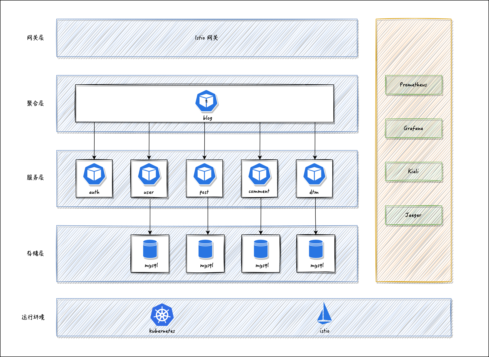
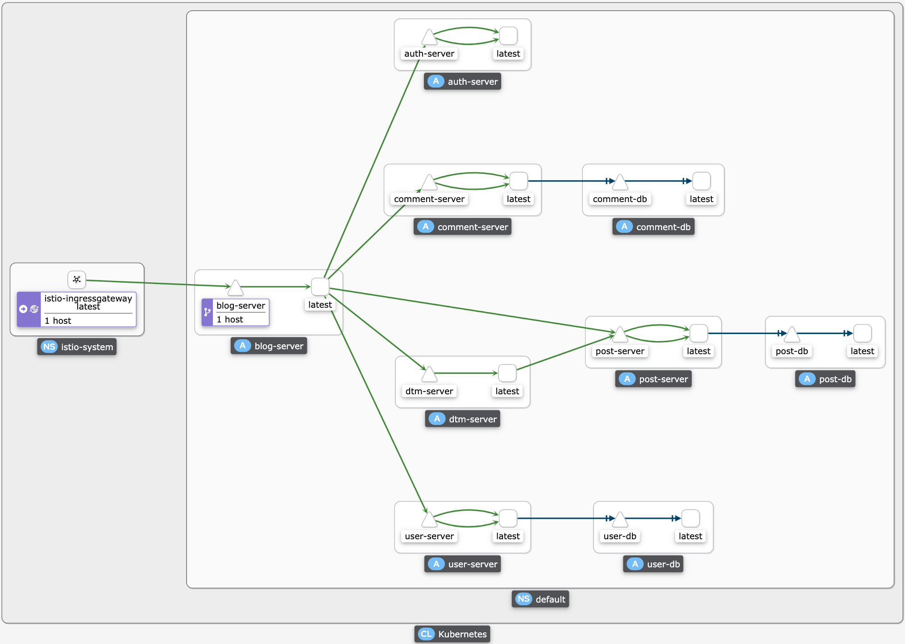
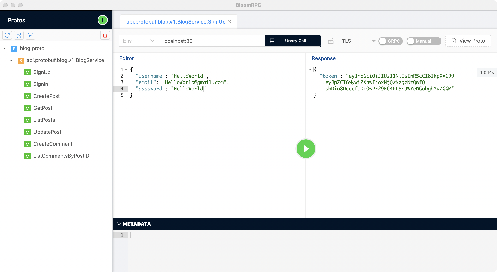
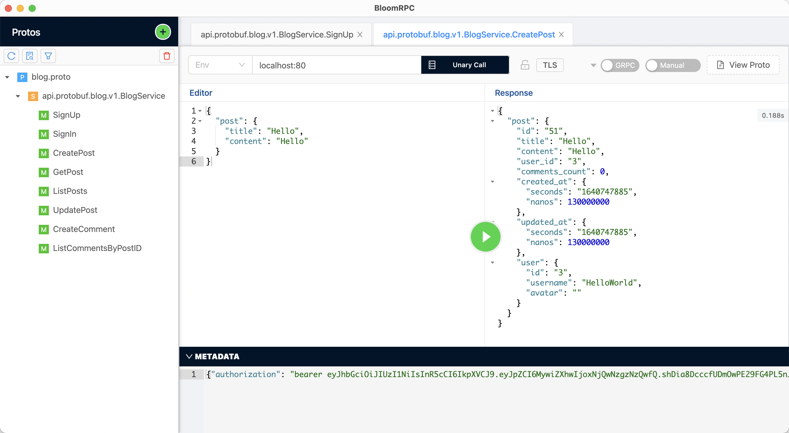

# blog-microservices

[](https://github.com/jxlwqq/blog-microservices/actions/workflows/test.yaml)

A blog microservices deployed in an Istio-enabled kubernetes cluster.

If you’re using this demo, please ★Star this repository to show your interest!


### 架构



### Kiali Console



### 目录结构

主要遵循 [Standard Go Project Layout](https://github.com/golang-standards/project-layout) 推荐的目录分层。

### 使用的依赖:

* [gRPC](https://github.com/grpc/grpc-go) 通信协议
* [GORM](https://github.com/go-gorm/gorm) 数据库 ORM
* [DTM](https://github.com/dtm-labs/dtm) 分布式事务管理器
* [Jaeger](https://www.jaegertracing.io/) 分布式追踪
* [Prometheus](https://prometheus.io/) 监控系统
* [Grafana](https://grafana.com/) 数据可视化
* [Kiali](https://kiali.io/) 可观察性工具
* [Kubernetes](https://kubernetes.io/) 容器编排
* [Istio](https://istio.io/) 服务网格

### Makefile 简介

| 命令                    | 说明                                                           |
|-----------------------|--------------------------------------------------------------|
| `make init`           | 安装各类 protoc-gen-* 、 wire 以及 migrate                          |
| `make protoc`         | 基于 *.proto 文件，生成各类 *_pb.go                                   |
| `make wire`           | 基于 wire.go 文件，生成 wire_gen.go                                 |
| `make test`           | 测试                                                           |
| `make migrate-up`     | 迁移数据库                                                        |
| `make migrate-down`   | 回滚数据库                                                        |
| `make blog-server`    | 启动 blog 服务（本地开发环境）                                           |
| `make user-server`    | 启动 user 服务（本地开发环境）                                           |
| `make post-server`    | 启动 post 服务（本地开发环境）                                           |
| `make comment-server` | 启动 comment 服务（本地开发环境）                                        |
| `make auth-server`    | 启动 auth 服务（本地开发环境）                                           |
| `make dtm-server`     | DTM 为外部依赖，启动本地服务，请浏览 [官方文档](https://github.com/dtm-labs/dtm) |
| `make docker-build`   | 构建 Docker 镜像                                                 |
| `make kube-deploy`    | 在集群中部署 blog、user、post、comment、auth 以及 dtm 服务                 |
| `make kube-delete`    | 在集群中删除上述服务                                                   |
| `make kube-redeploy`  | 在集群中重新部署服务（⚠️ 数据库服务不会重新部署）                                   |

### 本地环境搭建

* docker-desktop >= 4.3.2
* kubernetes >= 1.22.4
* go >= 1.17
* istioctl >= 1.12.1
* protobuf >= 3.19.1

下载安装 Docker Desktop ，并启动内置的 Kubernetes 集群。

```shell
# 安装 Go
brew install go
# 安装 Protobuf
brew install protobuf
# 安装 Istio
brew install istioctl
kubectl config use-context docker-desktop
istioctl install -y
kubectl label namespace default istio-injection=enabled
```

> ARM64 架构的用户安装 Istio，请查看 [这里](https://github.com/istio/istio/issues/21094#issuecomment-956117650) 以获取更多信息。

### 一键部署到本地集群

数据库初始化，项目相关的配置已经在 `deployments` 目录中的 yaml 文件中设置好，直接一键部署即可。

部署的资源比较多，请尽可能地将 Docker Desktop 的 CPU、Memory 拉高，避免 Pod 无法完成调度，详见 [这里](https://istio.io/latest/zh/docs/setup/platform-setup/docker/)。

```shell
make docker-build
make kube-deploy
```

查看 Pod 资源：

```shell
kubectl get pods -A
```

返回：

```shell
NAMESPACE      NAME                                     READY   STATUS    RESTARTS          AGE
default        auth-server-678f9d4b4-lhkf8              2/2     Running   0                 101s
default        blog-server-6475d7bdd5-6t9jk             2/2     Running   0                 101s
default        comment-db-59665d87f8-plswq              2/2     Running   0                 101s
default        comment-server-857445775b-qkpm5          2/2     Running   3 (74s ago)       100s
default        dtm-db-cb8c45698-qms8q                   2/2     Running   0                 102s
default        dtm-server-c548d67cc-xcv2z               2/2     Running   0                 102s
default        post-db-867f5f85db-zz64g                 2/2     Running   0                 101s
default        post-server-5448dc5b67-mdhcc             2/2     Running   4 (54s ago)       101s
default        user-db-fcfd47bf8-dh9kp                  2/2     Running   0                 101s
default        user-server-78688485b8-zf5tc             2/2     Running   3 (76s ago)       101s
istio-system   grafana-6ccd56f4b6-tp84j                 1/1     Running   0                 100s
istio-system   istio-egressgateway-67dc4b96cd-2gm6s     1/1     Running   5                 13d
istio-system   istio-ingressgateway-68d897fbcd-thvt9    1/1     Running   5                 13d
istio-system   istiod-66dc55cd96-r6cnv                  1/1     Running   5                 13d
istio-system   jaeger-9dd685668-wdzsz                   1/1     Running   0                 100s
istio-system   kiali-79b86ff5bc-jh6v8                   1/1     Running   0                 100s
istio-system   prometheus-64fd8ccd65-4c5nc              2/2     Running   0                 99s
kube-system    coredns-558bd4d5db-5nlbz                 1/1     Running   5                 13d
kube-system    coredns-558bd4d5db-m46lb                 1/1     Running   5                 13d
kube-system    etcd-docker-desktop                      1/1     Running   13                13d
kube-system    kube-apiserver-docker-desktop            1/1     Running   13                13d
kube-system    kube-controller-manager-docker-desktop   1/1     Running   13                13d
kube-system    kube-proxy-mj6x8                         1/1     Running   5                 13d
kube-system    kube-scheduler-docker-desktop            1/1     Running   13                13d
kube-system    storage-provisioner                      1/1     Running   11                13d
kube-system    vpnkit-controller                        1/1     Running   177 (2m56s ago)   13d
```

查看 Service 资源：

```shell
kubectl get services -A
```

返回：
```shell
NAMESPACE      NAME                   TYPE           CLUSTER-IP       EXTERNAL-IP   PORT(S)                                                                      AGE
default        auth-server            ClusterIP      10.99.64.145     <none>        50054/TCP,8054/TCP,9054/TCP                                                  15m
default        blog-server            ClusterIP      10.96.207.114    <none>        50050/TCP,8050/TCP,9050/TCP                                                  15m
default        comment-db             ClusterIP      10.99.195.67     <none>        3306/TCP                                                                     15m
default        comment-server         ClusterIP      10.96.179.191    <none>        50053/TCP,9053/TCP                                                           15m
default        dtm-db                 ClusterIP      10.106.31.52     <none>        3306/TCP                                                                     15m
default        dtm-server             ClusterIP      10.99.170.244    <none>        36790/TCP,36789/TCP,8889/TCP                                                 15m
default        kubernetes             ClusterIP      10.96.0.1        <none>        443/TCP                                                                      13d
default        post-db                ClusterIP      10.103.103.106   <none>        3306/TCP                                                                     15m
default        post-server            ClusterIP      10.96.232.141    <none>        50052/TCP,9052/TCP                                                           15m
default        user-db                ClusterIP      10.99.144.168    <none>        3306/TCP                                                                     15m
default        user-server            ClusterIP      10.100.66.36     <none>        50051/TCP,9051/TCP                                                           15m
istio-system   grafana                ClusterIP      10.105.48.42     <none>        3000/TCP                                                                     15m
istio-system   istio-egressgateway    ClusterIP      10.99.128.200    <none>        80/TCP,443/TCP                                                               13d
istio-system   istio-ingressgateway   LoadBalancer   10.101.116.168   localhost     15021:30898/TCP,80:32417/TCP,443:32343/TCP,31400:32210/TCP,15443:31544/TCP   13d
istio-system   istiod                 ClusterIP      10.108.250.181   <none>        15010/TCP,15012/TCP,443/TCP,15014/TCP                                        13d
istio-system   jaeger-collector       ClusterIP      10.103.107.169   <none>        14268/TCP,14250/TCP,9411/TCP                                                 15m
istio-system   kiali                  ClusterIP      10.111.157.82    <none>        20001/TCP,9090/TCP                                                           15m
istio-system   prometheus             ClusterIP      10.100.104.250   <none>        9090/TCP                                                                     15m
istio-system   tracing                ClusterIP      10.108.139.227   <none>        80/TCP,16685/TCP                                                             15m
istio-system   zipkin                 ClusterIP      10.101.235.179   <none>        9411/TCP                                                                     15m
kube-system    kube-dns               ClusterIP      10.96.0.10       <none>        53/UDP,53/TCP,9153/TCP                                                       13d
```


### 访问服务

推荐使用 [BloomRPC](https://github.com/bloomrpc/bloomrpc) 或者 [Insomnia](https://github.com/Kong/insomnia) ，导入 api/protobuf/blog.proto 文件后， 服务地址填写 `localhost:80` 端口即可访问，如下图所示：

注册：



创建文章：


